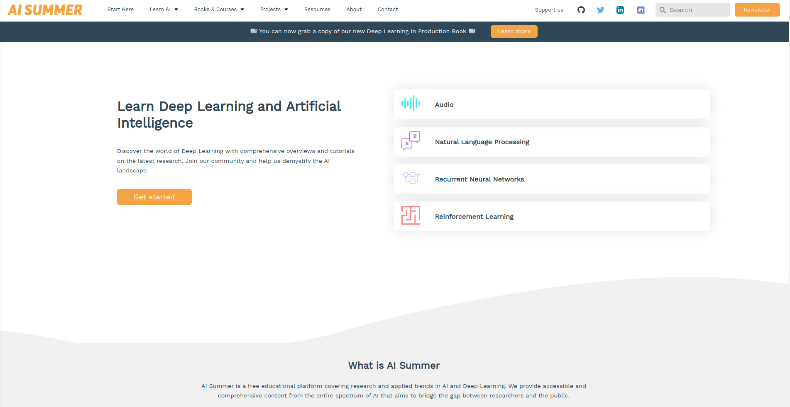
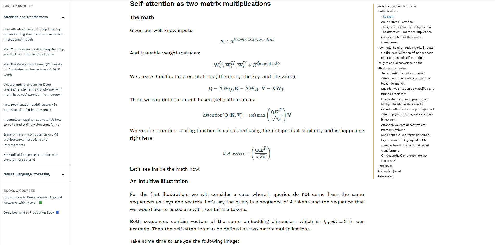
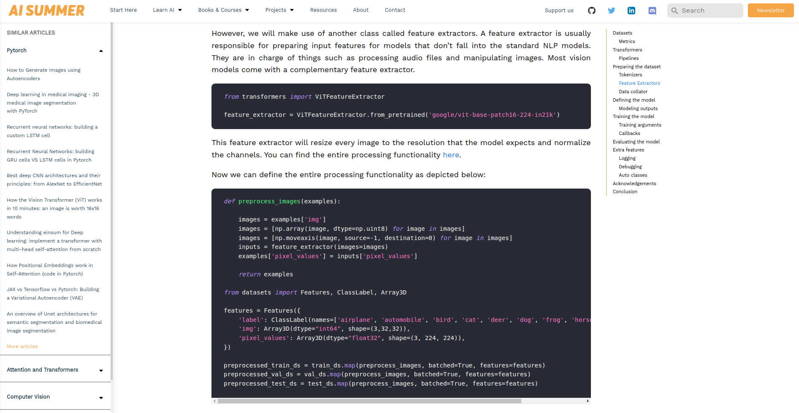
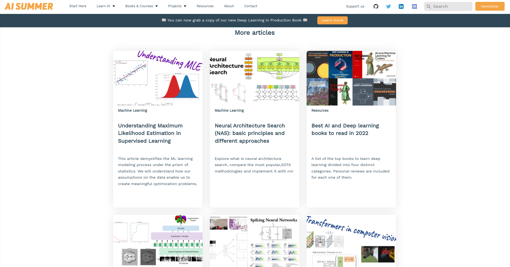

# Scientific blog template based on AI Summer



The current template can be used for scientific blogs as it supports a wide variety of necessary components such as:

- Latex rendering
- Code blocks with highlighting
- References and citations
- Embed gifs and videos
- Interactive components
- Table of contents
- Similar articles 

Other important features:

- Ability to filter and display posts by topic
- Customizable author pages 
- 100% responsive
- Pages can be created with standard React code or using Markdown
- Search with a local index using [flexsearch](https://github.com/nextapps-de/flexsearch)
- SEO ready
- Responsive images and image preprocessing pipeline
- Google analytics and tag manager 
- robots.txt generation
- XML feed generation
- Sitemap generation

## See a live example in our [website](https://theaisummer.com)

The template is based on [theaisummer.com](https://theaisummer.com), which we strip from all the unecessary stuff in order to provide a minimal, ready-to-use but feature-rich framework for scientific blogs.




### Important information

- The template is built with [Gatsby v2](https://www.gatsbyjs.com/) so some familiarity with React is required. For those who want to customize it, we highly recommend to check out the official [Gatsby docs](https://www.gatsbyjs.com/docs/)
- Typescript and TSX is used instead of Javascript
- The Sass preprocessor is used for styling
- MDX is used instead of Markdown so we can add custom React components inside markdown. That enables us high customizeability, interactive widgets and more.
- Latex is rendered with [Katex](https://katex.org/) and [remark-math](https://github.com/Rokt33r/remark-math)
- Code blocks are rendered with [prism-react-renderer](https://github.com/FormidableLabs/prism-react-renderer)
- Following Gatsby paradigm, GraphQL is used to query the website content
- Content can also be sourced using YAML files
- Forms can be created using [react-hook-form](https://react-hook-form.com/)
- Annimations on scroll support





### How to run the template

1) Instal the necessary dependencies

```
$ yarn install
```

2) Run Gatsby

```
$ yarn start
```

### What you need to do before deploying?

- Update `gatsby-config` with your site information
- Upload your logos and icons in `assets/images/`
- Update the `Seo.tsx` component
- Update your themes in `styles/`
- Update the yaml files in `site-content`

### How to deploy

1) Build the final static files

```
$ yarn build
```


2) Preview the website

```
$ yarn serve
```

3) Transfer the `public` folder to your hosting option of choice. For exammple, AI Summer is deployed on Firebase hosting, but any object storage will do just fine.

```
$ firebase deploy
```




## Support 
If you **really** like this repository and find it useful, please consider (★) **starring** it, so that it can reach a broader audience of like-minded people. It would be highly appreciated :) !

## Contributing and  Reporting Bugs
You are more than welcome to contribute to the template by adding more features, fixing bugs and more. Remember that this template was created by machine learning engineers and not web developers, so our sincere apologies in advance 😂

If you find a bug, create a GitHub issue, or even better, submit a pull request. Similarly, if you have questions, simply post them as GitHub issues. More info [here](./CONTRIBUTING.md).

## Current team

#### [Sergios Karagianakos](https://github.com/SergiosKar "Github page"), [Nikolas Adaloglou](https://github.com/black0017 "Github page") and [Ilias Papastatis](https://github.com/iliasprc "Github page") 

## License 

Copyright 2022, AI Summer.

Licensed under the Apache License, Version 2.0

See the [full license](./LICENSE).
